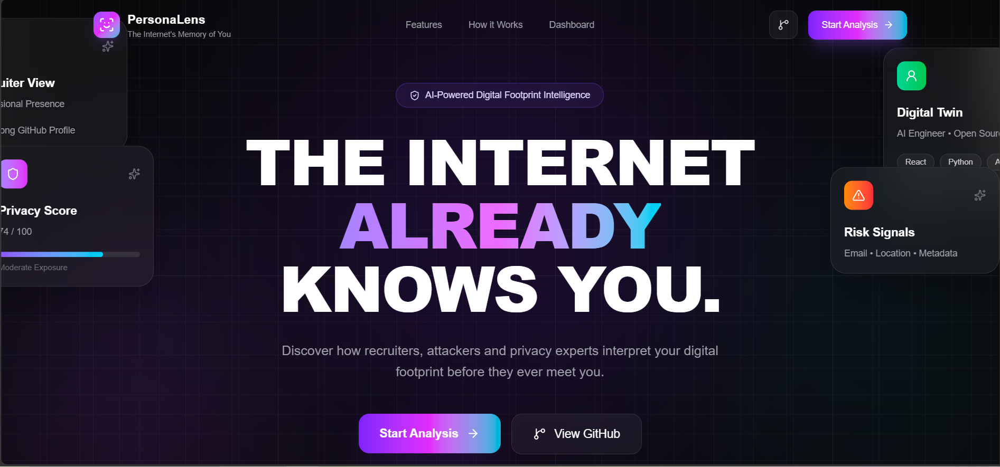
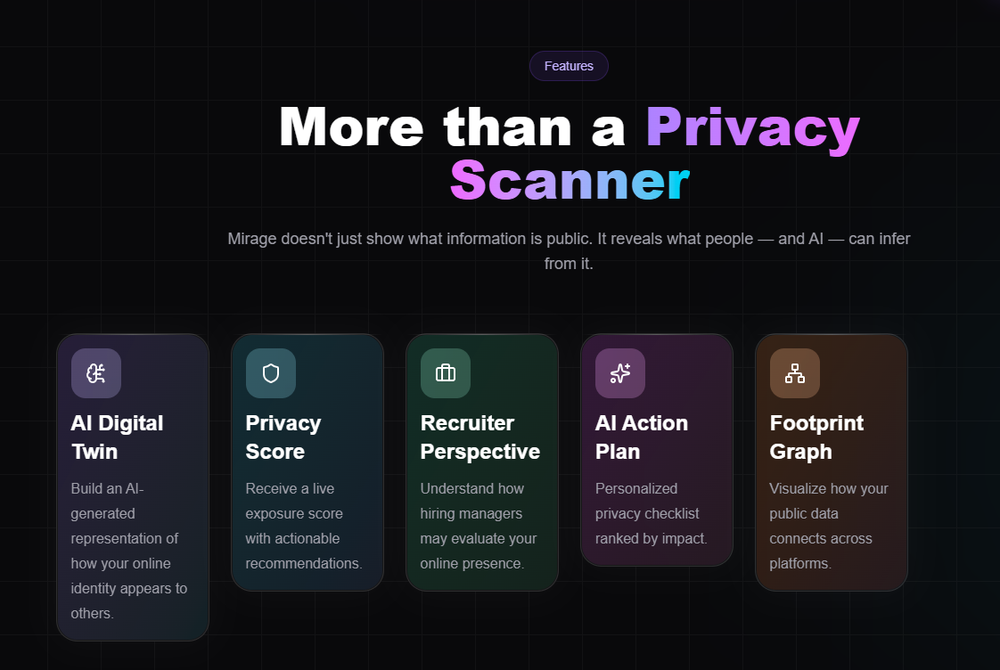
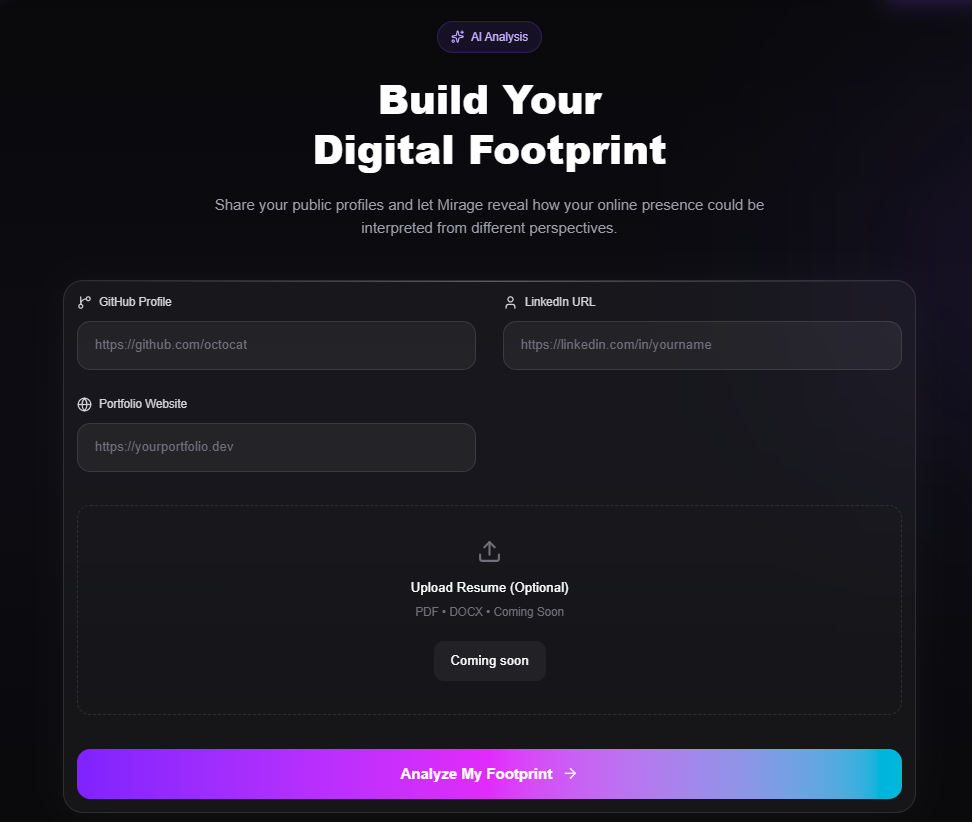
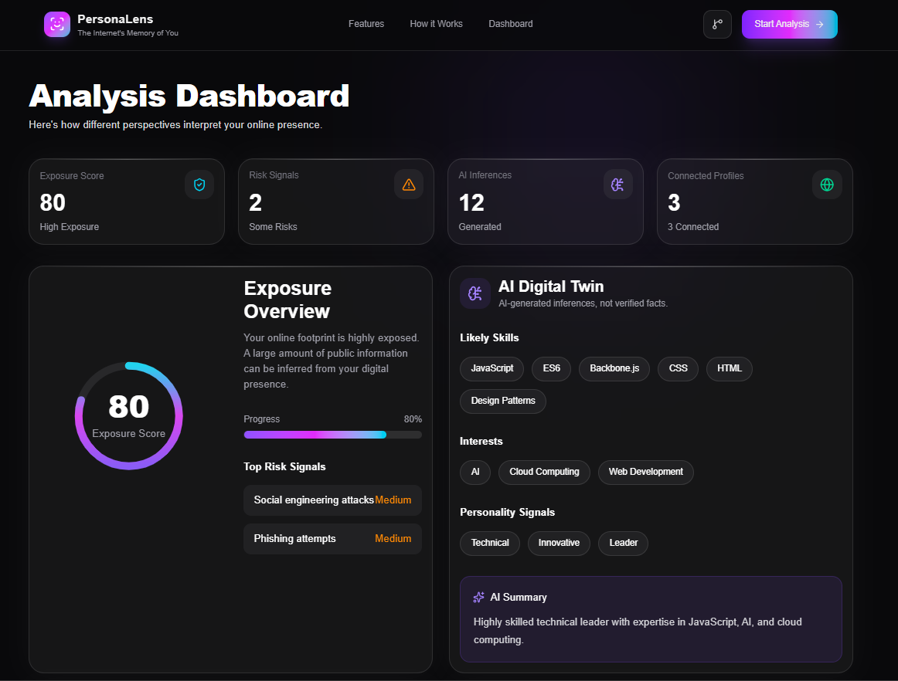
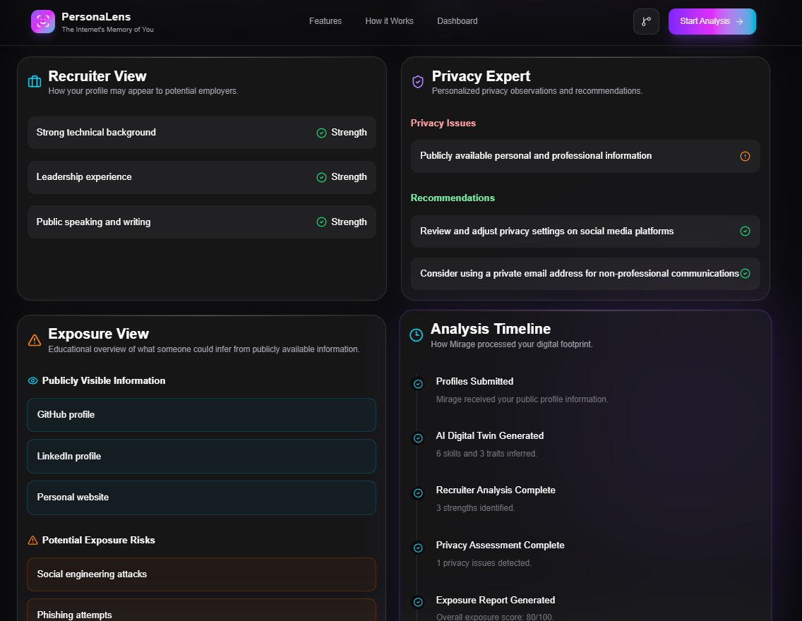

<div align="center">

# PersonaLens

### Digital Footprint Analyzer

Understand how the internet perceives you through AI-powered insights, privacy analysis, and digital identity visualization.

---



</div>

---

## 🚀 Inspiration

Every public profile tells a story.

GitHub, LinkedIn, and personal portfolios reveal far more than we realize—not only to recruiters, but also to AI systems and anyone browsing publicly available information.

**PersonaLens** helps users understand their digital footprint from multiple perspectives while providing actionable recommendations to improve privacy and online presence.

---

# ✨ Features

- 🤖 **AI Digital Twin**
  - AI-generated summary of skills, interests, and personality signals.

- 💼 **Recruiter View**
  - Simulates how a recruiter may interpret your public profile.

- 🔒 **Privacy Expert**
  - Highlights publicly visible information and privacy concerns.

- ⚠️ **Exposure View**
  - Educational overview of publicly exposed digital signals.

- 📊 **Exposure Score**
  - Quantifies overall online exposure.

- 🌐 **Digital Footprint Graph**
  - Visualizes relationships between your online profiles and inferred data.

- ✅ **AI Action Plan**
  - Personalized recommendations ranked by impact.

---

# 🛠 Tech Stack

### Frontend

- Next.js 15
- React
- TypeScript
- Tailwind CSS
- Framer Motion
- Lucide Icons

### Backend

- Next.js API Routes
- Groq LLM API
- GitHub REST API

---

# ⚙️ How It Works

```text
GitHub / LinkedIn / Portfolio
            │
            ▼
     Data Collection
            │
            ▼
      AI Processing
            │
            ▼
 Digital Twin Generation
            │
            ▼
 Exposure • Privacy • Recruiter
            │
            ▼
     Dashboard & Graph
```

---

# 📸 Screenshots

| Landing | Analysis |
|----------|----------|
|  |  |

| Dashboard | Views |
|-----------|-------|
|  |  |


---

# 📂 Project Structure

```text
app/
components/
lib/
public/
```

---

# 🚀 Running Locally

```bash
git clone https://github.com/yourusername/mirage.git

cd mirage

npm install

npm run dev
```

Create a `.env.local`

```env
GROQ_API_KEY=your_key
GITHUB_TOKEN=your_github_token
```

---

# 🎯 Future Scope

- 📄 Resume Parsing & ATS Analysis
- 🌍 Additional Social Platform Support
- 📈 Historical Footprint Tracking
- 🛡 Continuous Privacy Monitoring
- 📥 Downloadable Reports

---
### Team :
- Alisha Singh
- Anju Sinha
- Ishita Singh
- Kashish

---
<div align="center">

### Built with ❤️

*"Understand your digital identity before everyone else does."*

</div>
